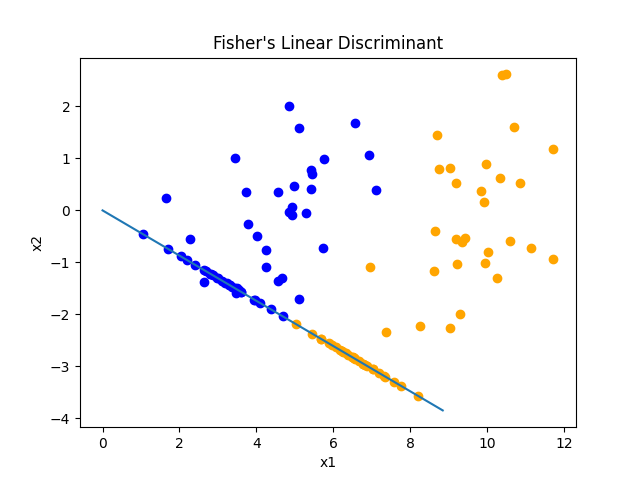

# Fisher's Linear Discriminant

This repository contains the code for Fisher's Linear Discriminant, as shown in the Pattern Recognition and Machine
Learning book.



## How to run
1) Install the Python modules in ```requirements.txt```
2) Run the code in the Jupyter Notebook.